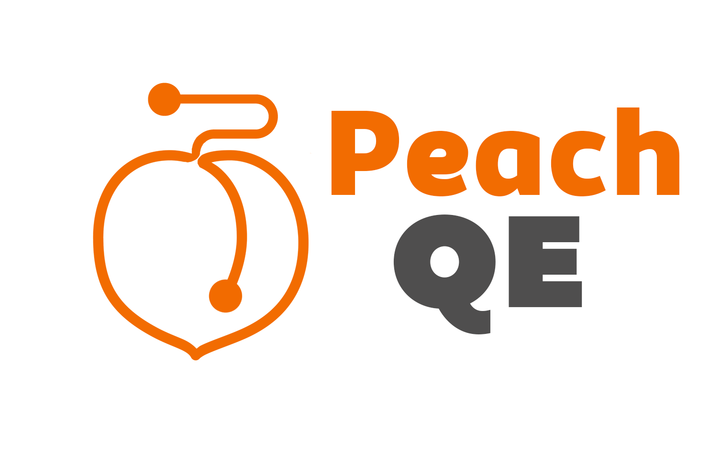
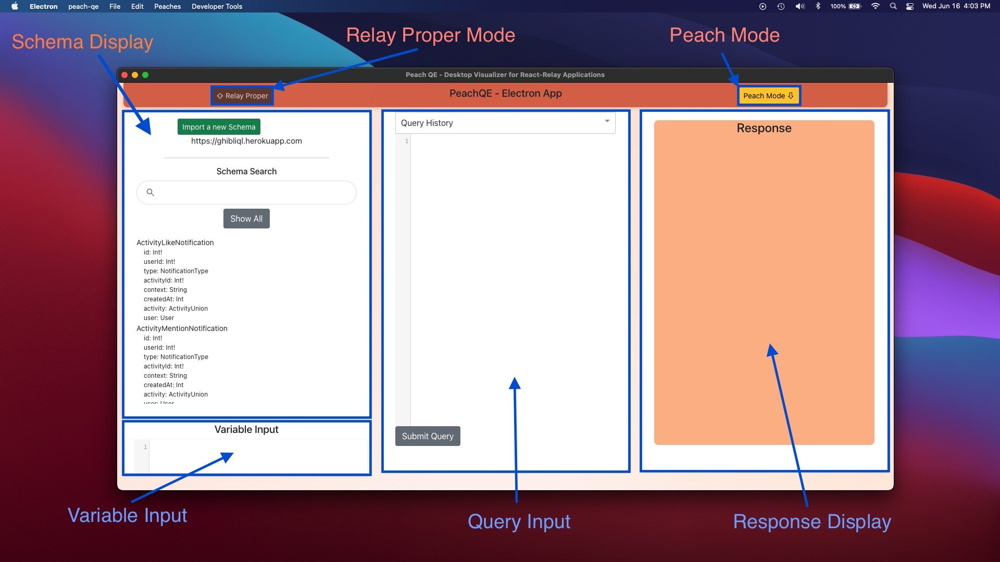
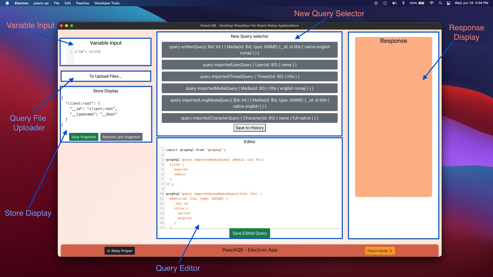
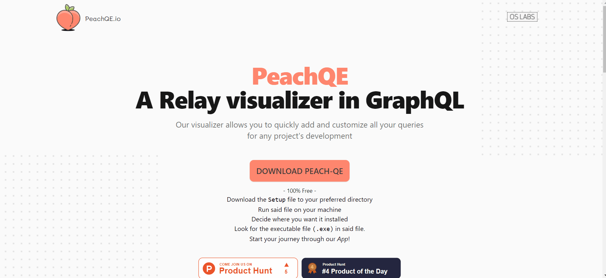

<!-- PROJECT LOGO -->
<br />
<p align="center">
  <a href="https://github.com/oslabs-beta/peach.git">
    
  </a>

  <h3 align="center">README</h3>

  <p align="center">
  <!--  -->
  
  
  
   
</p>

  <p align="center">
     <h1 align="center">Peach QE</h1>
    <p align="center">
A Relay visualizer for all your GraphQL queries.
  <br />
    <a href="https://www.peachqe.io" target="_BLANK" alt="PeachQE website">Homepage →</a><br>
    <a href="https://www.producthunt.com/posts/peach-qe-relay-visualizer" target="_BLANK">Product Hunt Page →</a>
</p>
    <br />
    <a href="#about-the-project"><strong>Explore the docs »</strong></a>
    <br />
    <!-- <br />
    <a href="#usage">View Demo</a>
    ·
    <a href="#s">Report Bug</a>
    ·
    <a href="#">Request Feature</a> -->
  </p>
</p>

<br />
<br />

<p align="center">    <a href="https://github.com/oslabs-beta/peach.git">
    
  </a></p>

<br />
<br />

<!-- TABLE OF CONTENTS -->
<details open="open">
  <summary>Table of Contents</summary>
  <ol>
    <li>
      <a href="#about-the-project" style="color:#ff7f50;">About The Project</a>
      <ul>
        <li><a href="#built-with">Built With</a></li>
      </ul>
    </li>
    <li>
      <a href="#getting-started" style="color:#ff7f50;">Getting Started</a>
      <ul>
        <li><a href="#prerequisites">Prerequisites</a></li>
      </ul>
    </li>
    <li><a href="#usage" style="color:#ff7f50;">Deployment</a></li>
    <li><a href="#license" style="color:#ff7f50;">License</a></li>
    <!-- <li><a href="#contact" style="color:#ff7f50;">Contact</a></li> -->
    <li><a href="#acknowledgements" style="color:#ff7f50;">Acknowledgements</a></li>
  </ol>
</details>

<br />

<!-- ABOUT THE PROJECT -->
## About The Project

Peach QE is the first Relay visualizer to handle all your GraphQL queries under one roof, directly on your desktop.
Upload pre-written queries, live-edit the queries you want to explore, edit variable inputs, and even handle as many databases as required.

<br />

### Built With


* [Relay](https://relay.dev/)
* [GraphQL](https://graphql.org/)
* [React](https://reactjs.org/)
* [Electron](https://www.electronjs.org/)
* [Webpack](https://webpack.js.org/)


<br />

<!-- GETTING STARTED -->
## Getting Started

* Fork and Clone the Repo:

   ```sh
   git clone https://github.com/oslabs-beta/peach.git
   ```

<br />

### Prerequisites

Install the dpendencies:

* [ npm i ]

  ```sh
  npm install
  ```
* Run the Electron App locally

  ```sh
  npm start
  ```

<br />

<!-- USAGE EXAMPLES -->
## Deployment

1. In order to build the executable file (aka, the desktop client) you will need to run specific commands for your OS:

* Mac:

   ```sh
   npm run package-mac
   ```

* Windows:

   ```sh
   npm run package-win
   ```

* Linux:

   ```sh
   npm run package-linux
   ```


2. Look for the directory **Release-builds** in the root folder where you cloned this Repo. (created automatically by the previous command)

3. Find the specific folder for your OS. (e.g., *peachQE-win*)

4. The file **peachQE.exe** (in Windows) will launch the app in your machine.

<br />

In **every** case, you will need to add the file [*schema.graphql*](https://github.com/oslabs-beta/peach/blob/dev/schema.graphql) to the root directory and the file [*imported.js*](https://github.com/oslabs-beta/peach/blob/dev/src/relay/imported.js) to the directory src>relay. For example: 

    .
    ├── (Root)                    # Installed Root folder
    ├── schema.graphql
    ├── src   
        ├── relay                 # Create both folders
              ├── imported.js     
    │   
    └── ...

<br /><br />

## User Manual

Once you have the application running, you will notice that PeachQE operates in two different "modes":

### Relay Proper

When the application first opens, the window will by default display "Relay Proper" mode, which contains much of the core functionality of the application:



1. The left section of the window is reserved for the **Schema Display**. Here, you can: 
    * View your current schema and type into the searchbar to find specific fields. 
    * Import a new Schema, updating the contents of the schema display to contain the newly imported schema.
    * Update the GraphQL API url endpoint. This determines what API PeachQE is interacting with.

2. Below the **Schema Display** you will find the **Variable Input**. Here you can:
    * Manually enter variables as JSON objects. 
    * The **Variable Input** will interact with the **Query Input** to set the response in the **Reponse Display**.

3. The central section is reserved for the **Query Input**. Here you can:
    * Manually type in valid GraphQL queries.
    * Select previous queries from the **Query History** dropdown. Once clicked the selected query will populate the Query Input Field.
    * **Submit** your query.

3. The right section is the **Response Display** which, upon clicking the **Submit Query** button, will display the reponses to any submitted query.

### Peach Mode



By clicking the yellow button titled **Peach Mode** at the top right corner of the window, or simply by scrolling down, you will find our designated UI for **Relay** specific functionality.

While the **Response Display** functions entirely the same, the central and left sections have been altered to accomodate for Relay-specific functionality.

1. The left section still contains a **Variable Input** with two additional fields:
    1. The **Query File Uploader** simply directs you to the "Peaches" dropdown from the menu bar, where you can "Start a New Peach" by uploading a file containing a list of GraphQL Queries.
    2. The **Store Display** offers you a direct visual of the Relay Store, a Relay-specific functionality that stores all the data sent by your GraphQL Queries, and all the data sent back from the responding GraphQL API. It is effectively a log of your interactions with a given GraphQl API, and it is made available with PeachQE!

2. The central section contains 2 new components:
    1. The **Query Editor** where you may copy/paste or manually type in multiple GraphQl Queries. Upon clicking **Save Edited Query**, the user inputted text will be saved and rendered as **Relay** queries, which will be displayed in the **New Query Selector**.
    2. The **New Query Selector** will contain a list of queries matching the queries inputted in the **Query Editor**. You may then toggle between these queries, and the **Response** display will update with the currently selected query.

<h3 align="center" style="color:#ff7f50;">
Enjoy!
</h3>

<br />
<br />

<!-- LICENSE -->
## Downloadable App
Or if you don’t want the codebase. Simply download our App!
https://peachqe.io/ <br />
Enjoy a simplified way to pick your peachy queries!




<br /><br />

<!-- LICENSE -->
## License

Distributed under the [MIT](https://github.com/oslabs-beta/peach/blob/dev/LICENSE) License. See [`LICENSE`](https://github.com/oslabs-beta/peach/blob/dev/LICENSE) for more information.

<br />

<!-- ACKNOWLEDGEMENTS -->
## <spam style="color:#ff7f50;">Acknowledgements to the PEach QE team:</spam>

* [Alura Chung-Mehdi](https://github.com/aluracm)
* [Roland Wynter](https://github.com/Rcwynter)
* [Graham Albachten](https://github.com/albachteng)
* [Nakami Hope-Felix](https://github.com/Nuckaahf)
* [Carlos Botero-Vargas](https://github.com/Carlos-BoteroVargas)

<br />

-------------

<h1 align="center">
THANK YOU!
</h1>
