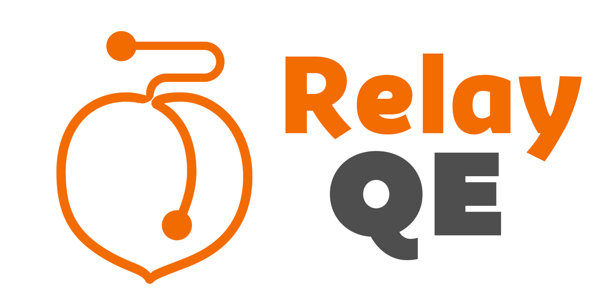

<!-- PROJECT LOGO -->
<br />
<p align="center">
  <a href="https://github.com/oslabs-beta/peach.git">
    
  </a>

  <h3 align="center">README - Peach QE</h3>

  <p align="center">
     - Initial Commit -
    <br />
    (Minimum set of features, including DevTools toggling in DEV mode)
    <br />
    <br />
    <a href="https://github.com/oslabs-beta/peach.git"><strong>Explore the docs »</strong></a>
    <br />
    <br />
    <a href="#usage">View Demo</a>
    ·
    <a href="#s">Report Bug</a>
    ·
    <a href="#">Request Feature</a>
  </p>
</p>

<br />
<br />

<p align="center">    <a href="https://github.com/oslabs-beta/peach.git">
    
  </a></p>

<br />
<br />

<!-- TABLE OF CONTENTS -->
<details open="open">
  <summary>Table of Contents</summary>
  <ol>
    <li>
      <a href="#about-the-project">About The Project</a>
      <ul>
        <li><a href="#built-with">Built With</a></li>
      </ul>
    </li>
    <li>
      <a href="#getting-started">Getting Started</a>
      <ul>
        <li><a href="#prerequisites">Prerequisites</a></li>
      </ul>
    </li>
    <li><a href="#usage">Deployment</a></li>
    <li><a href="#license">License</a></li>
    <li><a href="#contact">Contact</a></li>
    <li><a href="#acknowledgements">Acknowledgements</a></li>
  </ol>
</details>

<br />

<!-- ABOUT THE PROJECT -->
## About The Project

Our first hands on attempt to understand Relay.

<br />

### Built With

This section should list any major frameworks that you built your project using. Leave any add-ons/plugins for the acknowledgements section. Here are a few examples.

* [Electron](https://www.electronjs.org/)

<br />

<!-- GETTING STARTED -->
## Getting Started

* Fork and Clone the Repo:

   ```sh
   git clone https://github.com/oslabs-beta/peach.git
   ```

<br />

### Prerequisites

Install the dpendencies:

* [ npm i ]

  ```sh
  npm install
  ```
* Run the Electron App locally

  ```sh
  npm start
  ```

<br />

<!-- USAGE EXAMPLES -->
## Deployment

1. In order to build the executable file (aka, the desktop client) you will need to run specific commands for your OS:

* Mac:

   ```sh
   npm run package-mac
   ```

* Windows:

   ```sh
   npm run package-win
   ```

* Linux:

   ```sh
   npm run package-linux
   ```

2. Look for the directory **Release-builds** in the root folder where you cloned this Repo. (created automatically by the previous command)

3. Find the specific folder for your OS. (e.g., *peachQE-win*)

4. The file **peachQE.exe** (in Windows) will launch the app in your machine.

<br />

<h3 align="center">
Enjoy!
</h3>

<br />
<br />

_For more examples, please refer to the [Documentation](https://www.electronjs.org/)_

<br />

<!-- LICENSE -->
## License

Distributed under the MIT License. See `LICENSE` for more information.

<br />

<!-- ACKNOWLEDGEMENTS -->
## Acknowledgements to the PEach QE team:

* [Alura Chung-Mehdi](https://github.com/aluracm)
* [Roland Wynter](https://github.com/Rcwynter)
* [Graham Albachten](https://github.com/albachteng)
* [Nakami Hope-Felix](https://github.com/Nuckaahf)
* [Carlos Botero-Vargas](https://github.com/Carlos-BoteroVargas)

<br />

-------------

<h1 align="center">
THANK YOU!
</h1>
